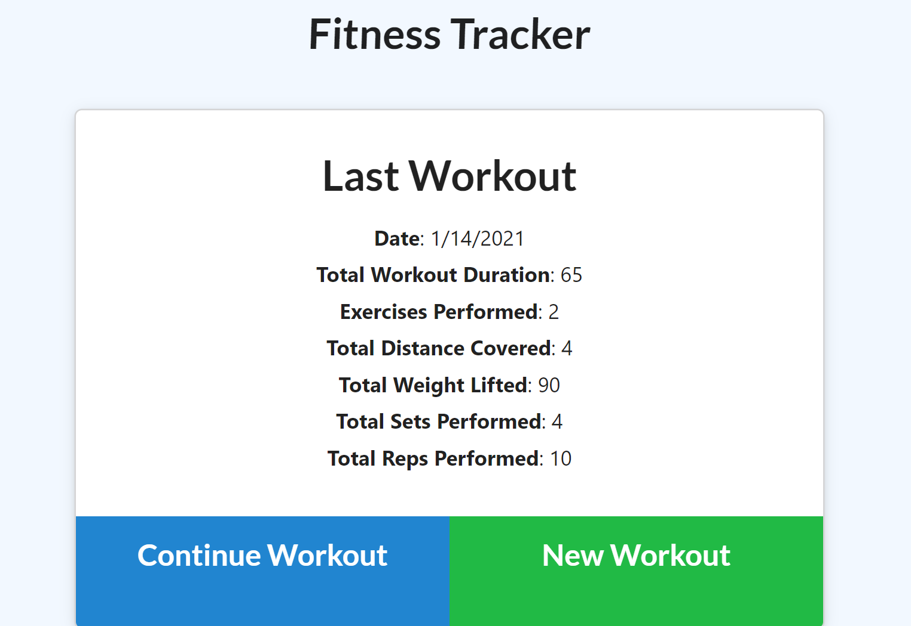
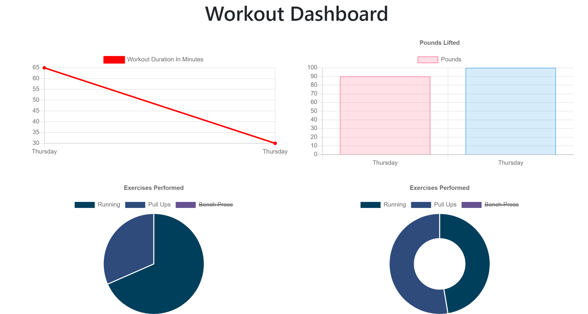

# Workout-Tracker

 
Explore the [project-page](https://github.com/Mgithub89/Workout-Tracker.git)

## Description
 A Workout Tracker App to view,create and track daily workouts to reach your fitness goals more quickly. The App will let you add multiple exercises to the most recent workout plan and to the new workout plan, view the combined weight of multiple exercises from the past seven workouts and view the total duration of each workout from the past seven workouts.
 

## Table Of Contents 
* [Installation](#Installation)
* [Usage](#Usage)
* [Technologies Used](#Technologies-Used)
* [Contributing](#Contributing)
* [Tests](#Tests)
* [License](#License)
* [Questions](#Questions)

## Installation
* Clone repo.
* install all the dependencies(npm i ...).

## usage 

## Screen Shoot
1. Last Workout

2.Last Week Summary

## Technologies used
* HTML
* CSS
* node
* JavaScript
* Express
* MongoDB

## Contributing
* Feel free to contribute. just contact me via email and fork my project

## Tests
* None

## License 
 
 For more information about the License , click on the link below.
 * [License](https://opensource.org/licenses/MIT)

## Questions
* For Questions you can reach me at [metages09@gmail.com](mailto:metages09@gmail.com)
* visit my [github profile](https://github.com/Mgithub89)
        
